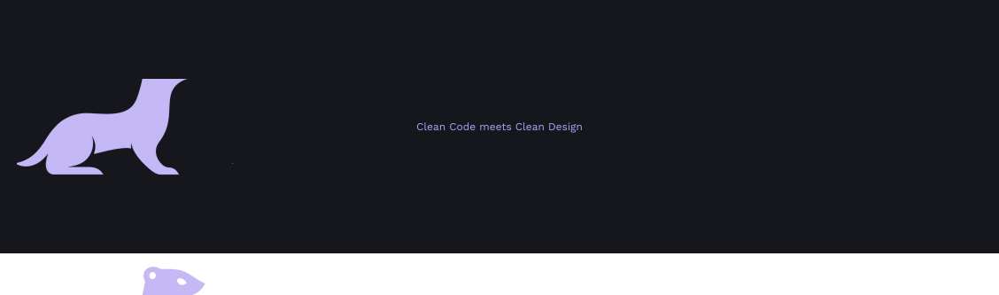

  

---

# 👋 Hey, ich bin Sarina, unterwegs zwischen Code, Kosmos und Science-Fiction.

💡 **Mobile Developerin** mit Schwerpunkt auf **Android (Kotlin · Jetpack Compose)**  
🎯 Fokus: Klarheit im Code · saubere Architektur · moderne UI/UX  
📱 Entwicklerin von **_Little Track_** (Makro-Tracking-App, verfügbar im Google Play Store)  
🧠 Arbeite aktuell am Projekt **Red Lucid**, ein Experimentierfeld für sprachgesteuerte Bots & KI-Features (Wakeword, Speech-to-Text, TTS, Security-Features).  

---

<table>
<tr>
<td width="25%" valign="top">

**Sprachen**  

  
  
  

</td>
<td width="75%" valign="top">

**Stack**

  
  
  
  
  
  
  
  
  
  
  
  
  
  
  
  
  
  
  
  
  

</td>
</tr>
</table>

---

## 🌌 Interessen  

> 🤖 **Künstliche Intelligenz & Machine Learning**  
> 🧠 **Sprachverarbeitung** (NLP, Speech-to-Text, TTS)  
> ✨ **Empfehlungssysteme**  
> 🎨 **Smarte User Experiences** & moderne App-Architekturen  

---

## 🚀 Projekte

> 📝 **[Memora](https://github.com/Rinari-Dev-Studio/memora)**  
> `Kotlin · Compose`  
> _Minimalistische Notizen-/To-Do-App mit Themes, Suche & Sortierung._

---

> 🎬 **[CineVibe (iOS)](https://github.com/Rinari-Dev-Studio/cinevibe-ios)**  
> `Swift · SwiftUI`  
> _Filmempfehlungs-App mit Familien & Benutzerprofilen, Swipe-Präferenzen und Favoritenlisten. Klarer Fokus auf UI/UX._

---

> 🔒 **LittleTrack**  
> `Kotlin · Compose`  
> _Makro-Tracking-App mit Tages-/Wochenübersicht, automatisierter Nährstoffberechnung, BMI & Body Recomposition Rechner, dynamischen Zielwerten._

---

> 🔒 **RefactorX**  
> `Kotlin · Compose`  
> _Kollaboratives Dev-Workspace mit Realtime-Database-Whiteboard & GitHub-API-Sync für nahtlose Zusammenarbeit._

---

> 🔒 **RedLucid**  
> `Kotlin · Compose`  
> _(Work-in-progress) Sprachgesteuerter KI-Assistent._
